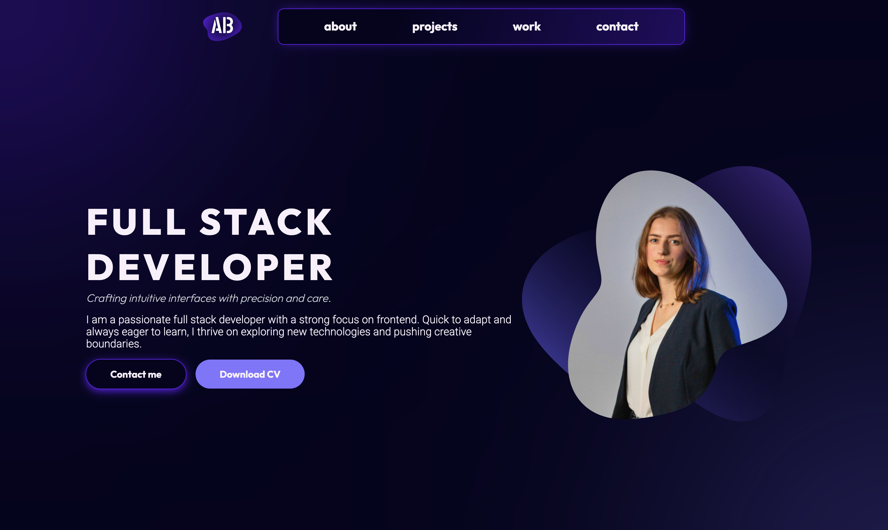

# 🧑‍💻 Portfolio – Alicja Buda

This is my personal developer portfolio – a space to highlight my favorite projects, technical skills, and passion for building thoughtful digital experiences.

The site was designed in Figma and built with Vue 3 and Tailwind CSS, with an emphasis on clean layout, strong UI/UX and responsive design.
I also built a custom backend using Node.js and Express to handle the contact form securely, allowing visitors to reach out directly.

The goal of this project was not only to present my work but to reflect my approach to code: minimalistic, elegant, and crafted with attention to detail.

link: [Alicja Buda | Portfolio](https://alicjabuda.vercel.app/)

---

## ✨ What you'll find here

- 🖥️ Clean and responsive layout
- 💜 Hero section and UI/UX focused design
- 📁 Featured projects with descriptions, tech stack, and links to repos
- 🧠 Work experience and skills overview
- 📬 Fully functional contact form connected to a Node.js backend

---

## 🛠️ Built with

**Frontend:**
- [Vue 3](https://vuejs.org/)
- [Vite](https://vitejs.dev/)
- [Tailwind CSS](https://tailwindcss.com/)
- [FontAwesome](https://fontawesome.com/)
- [Figma - link to UI project](https://www.figma.com/design/bWoUKF9Mneg7hQslHOWiGg/Portfolio?node-id=0-1&t=Qsod6beWKuzTh4TK-1)

**Backend (for contact form):**
- [Node.js](https://nodejs.org/)
- [Express](https://expressjs.com/)
- [Nodemailer](https://nodemailer.com/)

---

## 📷 Preview



---

## 🚀 How to run locally

```bash
# Clone the repo
git clone https://github.com/budaala/portfolio.git

# Frontend setup
cd client
npm install
npm run dev

# Backend setup (for contact form)
cd ../api
npm install
node index.js
```
Make sure to create a .env file in /api with your email credentials:
```bash
MAIL_USER=your@email.com
MAIL_PASS=your_generated_app_password
```

---

## 📫 Contact

Want to collaborate or just say hi?
Reach me at: alicjabuda@protonmail.com
